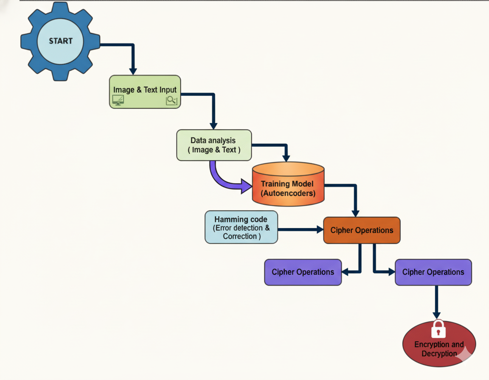

# DataVaultX
⚙️ Project Flow: Step-by-Step Breakdown
➡️ Input and Preparation
START: The process is initialized.

Image & Text Input: The system receives the raw, unsecured image and text data for processing.

Data Analysis: The input data undergoes pre-processing, normalization, and feature extraction to prepare it for model training.

🧠 Data Compression and Correction
Training Model (Autoencoders): The data is fed into the Autoencoder model, which compresses the data into an efficient latent representation (encoding) and learns to accurately reconstruct it (decoding).

Hamming Code (Error detection & Correction): The compressed data is protected by applying Hamming Codes. This crucial step adds redundancy to the data, allowing the system to automatically detect and correct single-bit errors that may occur during transmission or storage.

🔒 Security and Output
Cipher Operations (Encryption): The error-corrected data is scrambled using a chosen cipher technique, providing the necessary level of confidentiality and making the data unreadable to unauthorized users.

Cipher Operations (Transmission/Storage): This step represents the encrypted, protected state of the data while it is being transferred or stored.

Cipher Operations (Decryption): The receiver applies the corresponding decryption key to de-scramble the data, restoring it to its compressed, error-corrected form.

Encryption and Decryption (Final Output): The final, secure, and accurate data is reconstructed (using the Autoencoder's decoder) and delivered to the user.

This is the flow chart of project 

